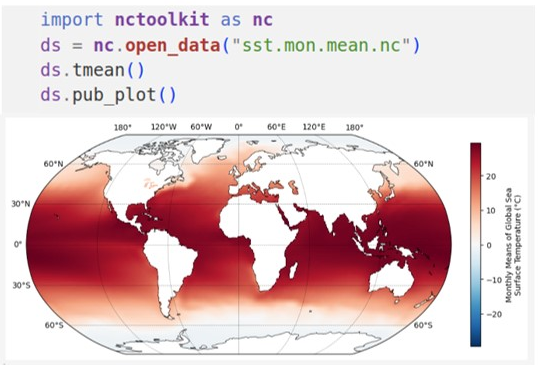

**nctoolkit**: A Python package for netCDF analysis and post-processing
=======================================================

nctoolkit is a comprehensive and computationally efficient Python package for analyzing and post-processing netCDF data.

Who is nctoolkit for?
########

Everyone from casual to regular users of netCDF data will find nctoolkit useful. Casual users will appreciate the easy ability to do such as things as matching up point observation data with gridded netCDF data. For expert users, nctoolkit provides the ability to carry out 80-100% of your day to day analysis and post-processing.

What type of data is nctoolkit designed for?
########

nctoolkit is designed primarily with climate and oceanic data in mind. If you work with this type of data, nctoolkit can help you do it quickly and efficiently.

What systems can nctoolkit work on? 
########

nctoolkit requires a Linux or macOS operating system.

What can nctoolkit do? 
########

The core abilities of nctoolkit include:

   - Cropping to geographic regions
   - Interactive plotting of data
   - Subsetting to specific time periods
   - Calculating time averages
   - Calculating spatial averages
   - Calculating rolling averages
   - Calculating climatologies
   - Creating new variables using arithmetic operations
   - Calculating anomalies
   - Horizontally and vertically remapping data
   - Calculating the correlations between variables
   - Calculating vertical averages for the likes of oceanic data
   - Calculating ensemble averages
   - Calculating phenological metrics

nctoolkit is developed as open source software by the Marine Systems Modelling group at `Plymouth Marine Laboratory. <https://www.pml.ac.uk/science/Marine-Systems-Modelling/>`__ 

.. image:: pml-logo.gif 
  :width: 600

.. toctree::
   :maxdepth: 1
   :hidden:
   :caption: Quick overview 

   installing
   introduction
   supported
   cheat

.. toctree::
   :maxdepth: 1
   :hidden:
   :caption: User Guide 

   datasets
   exporting 
   visualization
   subsetting 
   interpolation
   temporals 
   ensembles 
   matchpoint 
   variables
   verticals
   adding
   parallel 
   examples
   hacks 
   globals 
   backends
   troubleshoot

.. toctree::
   :maxdepth: 1
   :hidden:
   :caption: Reference & help

   api
   news
   citation
   contributing
   info
   

